<p align="center">
  <h1 align="center">AutoVision+</h1>
  <p align="center">
    <strong>Research-Grade Multimodal AutoML Platform</strong><br/>
    End-to-end automated ML for fused Image &times; Text &times; Tabular data &mdash;<br/>
    7-phase pipeline &bull; 7 fusion strategies incl. ULA Transformer &bull; LoRA PEFT &bull;<br/>
    Conformal Prediction &bull; SHAP / GradCAM / Attention Rollout XAI &bull; Live Drift Monitoring
  </p>
</p>

<p align="center">
  
  
  
  
  
</p>

<p align="center">
  <a href="https://github.com/hrishi-cz/automl/actions/workflows/ci.yml">
    
  </a>
  
  
  
</p>

---

## Problem Statement

Training machine learning models on **multimodal data** (images, free-text, and structured tabular features) is an unsolved operational bottleneck:

1. **Data Fusion Friction** -- Most AutoML frameworks (Auto-sklearn, AutoGluon, FLAML) treat modalities in isolation. Practitioners must manually engineer cross-modal feature pipelines, reconcile preprocessing schemas, and build custom fusion heads -- a process that is error-prone, time-consuming, and non-repeatable.

2. **Compute Waste During HPO** -- Standard hyperparameter optimization loops instantiate heavyweight pretrained encoders (BERT: ~440 MB, ResNet-50: ~100 MB) *per trial*, exhausting GPU VRAM after 2--3 trials and causing silent OOM crashes or "zombie" trials that leak GPU memory without contributing to the search.

3. **Feature Leakage at Scale** -- Raw datasets contain ID columns, datetime stamps, and high-cardinality strings that survive default preprocessing pipelines. Models train on these noise features, achieve artificially high validation scores, and **fail catastrophically in production**.

4. **Black-Box Inference** -- After training, prediction UIs blindly ask users to fill in *every* column from the original dataset -- including leaked IDs and dates the model never used -- while providing **zero guidance** on expected input schema.

**AutoVision+** solves all four problems within a single, opinionated **7-phase pipeline** that automates the entire journey from raw multi-source data to deployed, explainable predictions.

---

## Scope

### What AutoVision+ Handles

- **Multi-format ingestion** across CSV, Parquet, image directories, ZIP archives, HTTP URLs, and Kaggle API — with SHA-256 content-addressed caching to eliminate re-ingestion overhead
- **VRAM-aware JIT encoder selection**: dry-runs all candidate combinations (SigLIP-ViT-B/16, DINOv2, ResNet-50, ConvNeXt for vision; BERT, DeBERTa-v3, DistilBERT for text; GRN, FT-Transformer for tabular) before each trial, selecting the highest-capacity fit within 80% of available GPU memory
- **Parameter-Efficient Fine-Tuning (LoRA)**: rank `r ∈ {4, 8, 16}` injected into all transformer attention layers and exposed as a first-class Optuna search variable — 99.5% parameter reduction at r = 8 vs full fine-tuning
- **Seven multimodal fusion strategies** selectable via HPO: Unified Latent Alignment (ULA) cross-modal Transformer, FuseMoE Mixture-of-Experts, Graph Fusion, Gated Fusion, Uncertainty-Weighted Fusion, Attention Fusion, and Concatenation
- **Per-modality gradient health monitoring**: L2 gradient norms tracked per modality at every step; alignment loss weights dynamically scaled to prevent modality dominance
- **Two-stage probability calibration**: Temperature Scaling + Isotonic Regression, combined with **split conformal prediction sets** guaranteeing empirical coverage ≥ 1−α for any user-specified error rate
- **Modality-aware XAI dispatcher**: SHAP for tabular, GradCAM for CNN encoders, Attention Rollout for ViT encoders, Integrated Gradients as universal fallback — architecture-consistent attribution guaranteed
- **Composite drift monitoring** (PSI + Kolmogorov–Smirnov + MMD + cosine embedding drift) with three graduated autonomous retraining responses: full / classification-head-only / calibration-only
- **Production-grade training**: PyTorch Lightning with FP16 mixed precision, EarlyStopping, stratified splits, automatic class-imbalance weighting, and Windows CUDA TDR synchronization
- **Full artifact serialization** (weights, LoRA matrices, tokenizers, calibrators, preprocessors, schema contract, drift references) to a SQLite WAL versioned model registry
- **FastAPI backend** (60+ REST + WebSocket endpoints), SHA-256 inference cache, LRU engine cache, schema-guided prediction UI, and 7-phase Streamlit dashboard
- **Startup-loadable encoder plugins** via `config/encoder_plugins.py` for custom architectures without modifying core code

### What It Excludes

- Distributed multi-GPU / multi-node training (single-device only)
- Out-of-core datasets exceeding RAM (Polars/Dask lazy references are supported but materialized in-memory)
- Audio, video, or time-series modalities
- Production deployment orchestration (Kubernetes, model serving infrastructure)
- Automated feature engineering (feature interactions, polynomial expansion)

---

## Competitive Edge

| Capability | Auto-sklearn | AutoGluon | FLAML | **AutoVision+** |
|---|:---:|:---:|:---:|:---:|
| Tabular AutoML | ✅ | ✅ | ✅ | ✅ |
| Image + Text + Tabular Fusion | ❌ | Partial | ❌ | ✅ |
| Cross-Modal Transformer Fusion (ULA) | ❌ | ❌ | ❌ | ✅ |
| 7 Selectable Fusion Strategies via HPO | ❌ | ❌ | ❌ | ✅ |
| LoRA PEFT Rank as HPO Variable | ❌ | ❌ | ❌ | ✅ |
| JIT VRAM-Constrained Encoder Selection | N/A | ❌ | N/A | ✅ |
| Shared Frozen Encoders in HPO | N/A | ❌ | N/A | ✅ |
| Per-Modality Gradient Health Monitoring | ❌ | ❌ | ❌ | ✅ |
| Split Conformal Prediction Sets (coverage ≥ 1−α) | ❌ | ❌ | ❌ | ✅ |
| Architecture-Consistent XAI Dispatch (SHAP/GradCAM/Rollout) | ❌ | ❌ | ❌ | ✅ |
| Composite Drift Monitor + Graduated Retraining | ❌ | ❌ | ❌ | ✅ |
| Automatic ID/Date Column Leakage Filtering | ❌ | ❌ | ❌ | ✅ |
| Schema-Guided Inference API + UI | ❌ | ❌ | ❌ | ✅ |
| SQLite WAL Multi-Worker Task State | ❌ | ❌ | ❌ | ✅ |
| GitHub Actions CI + Docker Compose Deployment | ❌ | ❌ | ❌ | ✅ |

AutoVision+'s core differentiator is treating **the entire lifecycle** -- from raw data ingestion through drift-triggered retraining -- as a single automated pipeline, rather than a collection of disconnected notebooks. The 7-phase orchestrator ensures that preprocessing state, feature contracts, and model provenance are serialized atomically, **eliminating the "training-serving skew"** that plagues ad-hoc ML workflows.

---

## Architecture

### Pipeline Flow

```mermaid
graph LR
    subgraph "Data Layer"
        A[Multi-Source Ingestion<br/>CSV / Parquet / URL / Kaggle / ZIP] --> B[Schema Detection<br/>Target inference, modality classification]
    end

    subgraph "Preprocessing"
        B --> C1[Image Preprocessor<br/>Resize + Normalize + Augment]
        B --> C2[Text Preprocessor<br/>BERT Tokenization]
        B --> C3[Tabular Preprocessor<br/>Impute + Scale + OHE<br/>Auto-drop IDs/Dates]
    end

    subgraph "Training"
        C1 & C2 & C3 --> D[JIT Encoder Selector<br/>VRAM profiling + constrained optimization<br/>Startup-loadable encoder plugins]
        D --> D2[Embedding Pre-computation<br/>One-time frozen encoder forward pass]
        D2 --> E[Optuna HPO<br/>HyperbandPruner + EarlyStopping<br/>Shared frozen Image/Text encoders<br/>Per-trial trainable Tabular encoder]
        E --> F[PyTorch Lightning Trainer<br/>FP16 mixed precision + CosineAnnealingLR]
    end

    subgraph "Post-Training"
        F --> G[Drift Detection<br/>PSI + KS + MMD]
        G --> H[Model Registry<br/>Weights + Scalers + Schema + Metadata]
    end

    subgraph "Serving"
        H --> I["FastAPI Backend<br/>60+ REST/WebSocket endpoints<br/>LRU engine cache + SHA-256 inference cache"]
        I --> J["Streamlit Frontend<br/>7-phase guided workflow"]
        I --> K["XAI Dispatcher<br/>SHAP / GradCAM / Attention Rollout<br/>Integrated Gradients"]
        I --> L["Calibration<br/>Temperature Scaling + Isotonic<br/>Conformal Prediction Sets"]
    end
```



### Tech Stack

| Layer | Technology |
|---|---|
| **Encoders (Vision)** | SigLIP-ViT-B/16, DINOv2-B, ResNet-50, ConvNeXt-T, EfficientNet-B0 |
| **Encoders (Text)** | BERT-base, DeBERTa-v3-base, DistilBERT, MiniLM-L6-v2 |
| **Encoders (Tabular)** | Gated Residual Network (GRN), FT-Transformer, MLP |
| **Core ML** | PyTorch 2.x, PyTorch Lightning 2.6, HuggingFace Transformers 4.x |
| **PEFT** | LoRA (rank r ∈ {4,8,16} on Q/V projections of all transformer layers) |
| **Fusion** | ULA cross-modal Transformer, FuseMoE, Graph, Gated, Uncertainty-weighted, Attention, Concatenation |
| **AutoML / HPO** | Optuna 4.x (TPE + Median Stopping), JIT VRAM-constrained selector |
| **Calibration** | Temperature Scaling, Isotonic Regression, Split Conformal Prediction |
| **XAI** | SHAP (DeepExplainer), Captum (GradCAM, Attention Rollout, Integrated Gradients) |
| **Drift Detection** | PSI, Kolmogorov–Smirnov, MMD, Cosine Embedding Drift |
| **Backend** | FastAPI, Uvicorn, Pydantic, WebSocket streaming |
| **Frontend** | Streamlit, Altair |
| **Database** | SQLite 3 (WAL mode, multi-worker-safe via `task_store.py`) |
| **Preprocessing** | Scikit-learn ColumnTransformer, Pandas, NumPy, torchvision |
| **DevOps** | Docker, Docker Compose, GitHub Actions CI (lint + matrix test + E2E), DVC |
| **Data I/O** | aiohttp (async downloads), Polars/Dask (lazy loading), joblib (serialization) |

---

## Benchmark Results

All results produced on an NVIDIA RTX 3090 (24 GB VRAM), Intel i7-12700K, using 5-fold stratified cross-validation with seed 42. Full experimental logs are in `diary/results/`.

### Primary Classification Performance

| Metric | ULA (Proposed) | Best Unimodal Baseline | Improvement |
|---|---|---|---|
| Validation Accuracy | **95.3%** | 84.2% | +11.1 pp |
| F1-Score (macro) | **0.948** | 0.831 | +11.7 pp |
| Expected Calibration Error | **0.061** | 0.142 | −57% |
| Conformal Set Size (90% coverage) | 1.8 classes | — | — |

### Fusion Strategy Ablation

| Strategy | Accuracy | F1 | Notes |
|---|---|---|---|
| **ULA (proposed)** | **95.3%** | **0.948** | Cross-modal Transformer, best overall |
| FuseMoE | 93.8% | 0.931 | MoE routing, strong on heterogeneous data |
| Uncertainty-Weighted | 92.4% | 0.918 | Best under modality-missing conditions |
| Gated Fusion | 91.7% | 0.909 | Lightweight, low VRAM cost |
| Graph Fusion | 91.1% | 0.903 | Good on structured relational features |
| Attention Fusion | 90.6% | 0.897 | Stable, fast convergence |
| Concatenation (baseline) | 88.9% | 0.876 | Lowest complexity |

### LoRA Ablation (ULA backbone)

| LoRA Rank | Accuracy | Trainable Params | GPU Memory |
|---|---|---|---|
| Full fine-tuning | 95.6% | 110M | 18.4 GB |
| r = 16 | 95.5% | 1.1M (∙1%) | 4.2 GB |
| **r = 8 (selected)** | **95.3%** | **550K (0.5%)** | **2.1 GB** |
| r = 4 | 94.8% | 275K (0.25%) | 1.8 GB |

### Resource Efficiency

| Metric | Baseline Pipeline | AutoVision+ | Improvement |
|---|---|---|---|
| Peak VRAM per HPO trial | 5.8 GB | **0.85 GB** | **−85%** |
| Total GPU-hours (30 trials) | 22.5 h | **6.0 h** | **−73%** |
| OOM crashes across 30 trials | 7 | **0** | **−100%** |
| Inference latency (cached) | 120 ms | **18 ms** | **−85%** |
| Repeat-upload ingestion time | ~8 s | **<50 ms** | SHA-256 cache hit |

---

## Design Problems & Solutions

This section details the core design problems encountered during implementation and the architectural decisions made to solve them. Each entry describes the constraint, the design tradeoff, and the concrete mechanism implemented.

---

### 1. VRAM-Constrained Encoder Selection (JIT Selector)

**Design Problem:**
Multimodal pipelines need pretrained encoders (BERT ~440 MB, ResNet-50 ~100 MB) but available GPU memory varies wildly across deployment targets -- from 4 GB laptop GPUs to 24 GB workstation cards. Hardcoding encoder choices means either crashing on small GPUs or underutilizing large ones. The system needs to automatically maximize model capacity within hardware constraints, with zero user configuration.

**Design Tradeoff:**
Theoretical VRAM estimates (parameter count x dtype size) are inaccurate because PyTorch allocates CUDA context, activation buffers, and kernel workspace at runtime. Accurate selection requires measuring actual memory on the target device, but profiling every possible encoder combination at startup adds latency.

**Solution -- Constrained Cartesian-Product Search with Dummy-Forward Profiling:**

The JIT Encoder Selector (`automl/jit_encoder_selector.py`) maintains typed registries of vision, text, and tabular encoder specifications, each recording a factory function, output dimensionality, and a human-readable name. At selection time:

1. **Capacity Registry** -- Three sorted lists rank encoders by parameter count (descending). Vision: ConvNeXt-Tiny (28.6M params, 512-dim) > ResNet-50 (25.6M, 512-dim) > MobileNetV3-Small (2.5M, 512-dim). Text: DeBERTa-v3-base (768-dim) > BERT-base (768-dim) > MiniLM-L6-v2 (384-dim, projected to 768). Tabular: GRN (16-dim) > MLP (16-dim).

2. **Exhaustive Search** -- The selector enumerates the Cartesian product of all vision x text candidates (3 x 3 = 9 combinations). Combinations are sorted descending by total capacity so the first feasible solution found is guaranteed to be the maximum-capacity fit.

3. **Dummy-Forward VRAM Profiling** -- Each candidate combination is instantiated on GPU, a synthetic batch is passed through, and `torch.cuda.max_memory_allocated()` records actual peak VRAM. A safety margin (eta = 0.85) reserves 15% of total VRAM for optimizer state and activations during training.

4. **Graceful Degradation** -- If no GPU combination fits, the selector falls back to CPU with the smallest encoders (MobileNetV3-Small + MiniLM-L6-v2). The fallback path still returns valid encoder specs so downstream code requires no special handling.

5. **Public Registration API** -- `register_vision_encoder()`, `register_text_encoder()`, `register_tabular_encoder()` allow external code to inject custom encoders that are automatically sorted into the capacity ranking and participate in constrained selection. A plugin file (`config/encoder_plugins.py`) is loaded at startup.

**Why This Design:**
Dummy-forward profiling adds ~2-5 seconds of startup latency but eliminates all estimation error. Sorting by descending capacity with early termination means we find the optimal combination in O(n) on average (first feasible = best). The registration API makes the system extensible without modifying core optimizer code.

---

### 2. Multi-Layer Caching Architecture

**Design Problem:**
The pipeline has three distinct performance bottlenecks where redundant computation dominates wall-clock time: (a) re-downloading and re-parsing datasets on repeated runs, (b) re-running frozen encoder forward passes identically across every Optuna trial, and (c) re-loading and re-constructing inference engines on repeated API calls. Each bottleneck requires a different caching strategy because the data shapes, invalidation semantics, and concurrency requirements differ.

**Solution -- Three Specialized Cache Layers:**

#### Layer 1: Data Ingestion Cache (SHA-256 Source-Addressed)

`data_ingestion/ingestion_manager.py`

- **Mechanism:** Every ingested source (URL, file path, Kaggle slug) is hashed using SHA-256 (16-character truncated digest) after URL normalization (Kaggle slugs are canonicalized). The hash is computed on the *normalized source string*, not the file contents. Ingested DataFrames are persisted in a `data/dataset_cache/` directory with the hash as subdirectory name.
- **Invalidation:** Source-addressed -- the same source URL always produces the same hash, so no TTL or manual invalidation is needed. Re-ingesting an unchanged source is a zero-cost cache hit.
- **Atomicity:** Metadata writes use `tempfile.mkstemp()` + `os.replace()` for atomic file replacement, preventing corrupted metadata if the process crashes mid-write.
- **Migration:** Legacy hashes (SHA-256 on raw, non-normalized source strings) are detected and transparently upgraded to normalized hashes on first access.

#### Layer 2: Frozen Encoder Embedding Pre-computation (Tensor Cache)

`pipeline/training_orchestrator.py`

- **Mechanism:** After JIT encoder selection but before the Optuna study, a single forward pass through frozen text/image encoders pre-computes embeddings for the entire dataset. Text embeddings (deterministic, no augmentation) are cached as `[N, dim]` CPU tensors for both train and val splits. Image embeddings are cached for val only -- training images must go through random augmentation (RandomFlip, Rotate, ColorJitter) that must remain stochastic per epoch.
- **Index Alignment:** Pre-computed tensors use 0-based contiguous indexing aligned to `torch.utils.data.Subset` indices, so `__getitem__(idx)` can directly index into the pre-computed tensor without mapping.
- **Bypass Detection:** `_encode_batch()` in the trainer checks for `text_pooled` / `image_pooled` keys in the batch dict. If present, it skips the frozen encoder forward pass entirely. If absent (no pre-computation or tabular-only run), the encoder path runs as before -- fully backward-compatible.

#### Layer 3: LRU Inference Engine Cache (Thread-Safe OrderedDict)

`run_api.py`

- **Mechanism:** `collections.OrderedDict` keyed by `model_id`, protected by `threading.Lock`. On cache hit, `move_to_end()` promotes the entry to MRU position. On cache miss, the engine is constructed (model + preprocessors + schema loaded from registry), inserted, and if the cache exceeds `max_size=5`, `popitem(last=False)` evicts the LRU entry.
- **Concurrency:** The lock is held only for dict operations (get/put/evict), not during engine construction. This means concurrent requests for different models can construct engines in parallel; only the final cache insertion is serialized.
- **Shared by REST + WebSocket:** Both `/predict` (REST) and `/ws/predict` (WebSocket) endpoints use the same cache instance, preventing duplicate engine loads.

---

### 3. GPU Memory Lifecycle Management

**Design Problem:**
Optuna's HyperbandPruner prunes underperforming trials mid-training. When a trial is pruned, its model, CUDA tensors, and Lightning trainer graph remain allocated on the GPU -- "zombie trials" that consume VRAM without contributing to the search. After 2-3 pruned trials, the GPU is exhausted and subsequent trials crash with OOM.

**Solution -- Unconditional GPU Cleanup with Fail-Safe Teardown:**

Every HPO trial is wrapped in a `try/except/finally` block in `pipeline/training_orchestrator.py`. The `finally` clause executes unconditionally -- on success, error, *and* Optuna pruning:

1. Non-winning trial models are moved to CPU and dereferenced
2. `torch.cuda.empty_cache()` releases the CUDA memory pool
3. `gc.collect()` forces Python garbage collection of circular references
4. Only the current best model is retained in VRAM

Combined with HyperbandPruner (aggressively killing bottom-performing trials at intermediate epochs) and EarlyStopping (halting stalled training after consecutive epochs of no improvement), 100% of GPU budget is directed toward promising configurations.

**Why This Design:**
The `finally` block is critical because Optuna raises `optuna.TrialPruned` (a subclass of `Exception`) to signal pruning -- a bare `except` would catch it, but the model cleanup code must run regardless of *how* the trial ends. Explicit `finally` is the only pattern that guarantees cleanup in all three exit paths (success, error, prune).

---

### 4. Schema Contract Propagation (Training-Serving Consistency)

**Design Problem:**
The preprocessing phase auto-filters noise columns (IDs, timestamps, high-cardinality strings) using heuristic detection. This creates a divergence: the raw ingested schema has N columns, but the model was trained on M < N columns. Without explicit contract propagation, the inference API expects N columns, the frontend renders N input fields, and payloads fail validation.

**Solution -- 3-Layer Feature Contract:**

1. **Preprocessing Layer** (`preprocessing/tabular_preprocessor.py`) -- Heuristic ID detection uses regex word-boundary matching (`(?:^|_)(?:id|idx|index|key|serial|pk|fk)(?:$|_)`) on column names, uniqueness-ratio thresholds (>0.5 for categorical, >0.9 for integer columns), and datetime string probing. Filtered columns are recorded, and the surviving column list is persisted as `_feature_names_in` inside the serialized preprocessor artifact (exposed as `effective_features` by the API layer).

2. **API Layer** (`run_api.py`) -- The `/model-info/{model_id}` endpoint loads the fitted preprocessor from the model registry and returns only the columns the model actually uses, plus a separate list of auto-dropped columns for transparency. Model IDs are validated with regex (`^[\w\-.:]+$`) and `..` rejection to prevent directory traversal.

3. **Frontend Layer** (`frontend/app_enhanced.py`) -- The Streamlit prediction form dynamically renders input fields for effective features only. Batch upload mode displays a schema requirements banner and offers a downloadable CSV template with correct headers pre-filled.

**Why This Design:**
The contract is stored inside the preprocessor artifact (not a separate metadata file) because the preprocessor is the single source of truth for which columns survive filtering. Storing it separately would create a synchronization problem. The 3-layer approach ensures that no layer can independently diverge from the training-time schema.

---

### 5. SQLite WAL Task State (Multi-Worker Async Persistence)

**Design Problem:**
The FastAPI backend runs long-running operations (ingestion, training, inference) as background tasks using a fire-and-poll pattern (`POST /predict-async` -> `GET /task/{id}`). The original implementation stored task state in in-memory Python dicts, which breaks under multi-worker Uvicorn deployments: a task submitted to worker A is invisible to worker B's poll endpoint.

**Design Tradeoff:**
Redis or PostgreSQL would solve cross-worker visibility but add infrastructure dependencies. For a pipeline tool that needs to run on a single machine with zero external services, the persistence layer must be self-contained.

**Solution -- SQLite with WAL Journal Mode:**

`task_store.py` implements a `TaskStateManager` with:

- **Single Table Schema:** `TaskState(task_id TEXT PK, task_type TEXT, status TEXT, result TEXT, error TEXT, payload TEXT DEFAULT '{}', created_at TEXT)`. Type-specific progress data (epoch metrics, dataset lists, phase progress) is stored as JSON in the `payload` column.
- **WAL Mode:** `PRAGMA journal_mode=WAL` enables concurrent readers during writes. Multiple Uvicorn workers can poll task status while another worker updates it.
- **Atomic Read-Modify-Write:** `merge_payload()` and `append_to_payload_list()` use `BEGIN IMMEDIATE` transactions to prevent TOCTOU races when two workers try to update the same task's payload simultaneously. On conflict, the transaction is rolled back and re-raised.
- **Connection-Per-Operation:** Each method opens a fresh connection, executes, and closes in a `try/finally` block. This avoids SQLite's "database is locked" errors from long-held connections and is safe for multi-threaded access.
- **Busy Timeout:** `busy_timeout=5000` (5 seconds) prevents immediate failure under write contention.
- **Typed Trackers:** `IngestionProgressTracker` and `TrainingProgressTracker` wrap the raw `TaskStateManager` with structured update methods (`set_phase()`, `log_epoch()`, `report_dataset()`) that maintain backward-compatible method signatures from the original in-memory implementation.

**Why This Design:**
SQLite is the only embedded database in Python's standard library. WAL mode gives us concurrent read/write without external infrastructure. The connection-per-operation pattern trades connection pool efficiency for correctness -- in a pipeline tool processing a handful of concurrent tasks, the overhead is negligible. `BEGIN IMMEDIATE` is used instead of `BEGIN DEFERRED` because deferred transactions can silently upgrade to write locks mid-transaction, causing unexpected `SQLITE_BUSY` errors.

---

### 6. Trainable Tabular Encoding (GRN Architecture)

**Design Problem:**
Image and text modalities have pretrained encoders projecting into 512-768 dimensional embedding spaces. Tabular data was passed through raw -- its N-dimensional feature vector was concatenated directly with rich encoder embeddings. This representation imbalance caused the fusion head to underweight tabular signals.

**Design Tradeoff:**
Making the tabular encoder trainable means it cannot be shared across Optuna trials (unlike frozen image/text encoders), because each trial must explore a different region of the tabular encoding space. This increases per-trial computation but enables HPO to treat tabular representation quality as a searchable hyperparameter.

**Solution -- Gated Residual Network with Per-Trial Re-initialization:**

`modelss/encoders/tabular.py` implements a GRN:

1. **Architecture:** FC1 -> ELU -> FC2 with element-wise sigmoid gating, skip connection via learned linear projection, LayerNorm, and final projection to 16-dimensional output
2. **Per-Trial Fresh Init:** Unlike image/text encoders (instantiated once, shared by reference), the tabular encoder is freshly instantiated per Optuna trial with independent random initialization
3. **Proper Module Registration:** Registered as `nn.Module` submodule (not bypassed via `object.__setattr__`) so its parameters participate in the optimizer and receive gradients
4. **Xavier Initialization:** For the MiniLM text encoder variant, the random projection layer uses `xavier_uniform_` initialization before freezing to prevent gradient-scale mismatch

---

### 7. 7-Phase Pipeline Orchestration with Fault Isolation

**Design Problem:**
An end-to-end ML pipeline has sequential dependencies (schema detection must precede preprocessing, which must precede training) but each phase can fail independently. A monolithic try/except around the entire pipeline loses all intermediate results on any failure, and provides no visibility into which phase failed or how far the pipeline progressed.

**Solution -- Phase-Isolated Sequential Execution:**

`pipeline/training_orchestrator.py` defines a `Phase` enum with 7 values and executes them sequentially:

1. **Phase 1 (Data Ingestion)** -- Async, concurrent multi-URL downloads with per-URL fault isolation. A failed source is logged and skipped; all remaining sources continue.
2. **Phase 2 (Schema Detection)** -- Infers target column, problem type, and modality classification.
3. **Phase 3 (Preprocessing)** -- Modality-specific transforms with automatic noise column filtering.
4. **Phase 4 (Model Selection)** -- JIT encoder selection + VRAM profiling.
5. **Phase 5 (Training)** -- Optuna HPO with embedding pre-computation and GPU lifecycle management.
6. **Phase 6 (Drift Detection)** -- PSI, KS-test, and MMD statistical tests.
7. **Phase 7 (Model Registry)** -- Atomic serialization of weights, preprocessors, and schema metadata.

Each phase stores its results in `self.phase_results[Phase.XXX]`. Phase 1 is async (concurrent downloads); Phases 2-7 are synchronous and sequential. Per-phase error isolation means a drift detection failure (Phase 6) does not prevent model registration (Phase 7) from completing with results from Phase 5.

Progress is tracked via `TrainingProgressTracker` (SQLite-backed), which streams phase status, epoch metrics, and completion state to the frontend in real time.

---

### 8. Real-Time Inference via WebSocket Streaming

**Design Problem:**
The fire-and-poll pattern (`POST /predict-async` + polling `GET /task/{id}`) introduces 0.5-3 second latency per poll interval and provides no granular progress for large batch predictions. Users submitting 1000+ row inference requests have zero visibility until the entire batch completes.

**Solution -- Persistent WebSocket with Chunked Progress Frames:**

`run_api.py` exposes `WS /ws/predict` that streams structured JSON frames:

```
CONNECTED -> LOADING_MODEL -> PROCESSING -> progress (per 100 rows) -> GENERATING_EXPLANATIONS -> complete
```

- Large batches are chunked into 100-row sub-batches with progress frames after each chunk
- The endpoint reuses the LRU engine cache (same `_engine_cache` + `_engine_cache_lock`), so a model loaded via REST is immediately available via WebSocket and vice versa
- Error frames (`{"type": "error", ...}`) handle invalid model IDs, malformed JSON, and batch size limits (10K max)
- `WebSocketDisconnect` is caught gracefully -- no server-side crash or resource leak
- The existing REST endpoints (`/predict`, `/predict-async`) remain fully functional and unchanged
- The Streamlit frontend uses REST polling for inference; the WebSocket endpoint is designed for programmatic clients and custom frontends that benefit from sub-second streaming feedback

---

### 9. Security Hardening

**Design Problem:**
ML pipeline tools are typically built for local development and lack basic input validation. When exposed via API, they become vulnerable to path traversal (model IDs containing `../`), ZIP slip (malicious archives extracting outside target directory), XSS (user-supplied text rendered as HTML in attribution visualizations), and data races (concurrent API requests mutating shared session state).

**Solutions Implemented:**

| Vulnerability | Location | Mechanism |
|---|---|---|
| **Directory Traversal** | `run_api.py` | Regex validation (`^[\w\-.:]+$`) + `..` rejection on all `model_id` parameters |
| **ZipSlip** | `ingestion_manager.py` | Member path resolution + `startswith()` check before `extractall()` |
| **XSS** | `app_enhanced.py` | `html.escape()` on all user-derived token text before HTML embedding |
| **CORS Misconfiguration** | `run_api.py` | Origin whitelist (`localhost:8501`, `127.0.0.1:8501`) instead of wildcard `*` |
| **Session State Races** | `run_api.py` | `threading.Lock` protecting shared `session_ingested_hashes` on `/detect-schema` and `/preprocess` |
| **SQLite TOCTOU** | `task_store.py` | `BEGIN IMMEDIATE` transactions for atomic read-modify-write on payload updates |
| **Unsafe Deserialization** | `model_registry.py` | `torch.load(..., weights_only=True)` to prevent arbitrary code execution via pickle |

---

### 10. Cross-Platform GPU Safety (Windows TDR)

**Design Problem:**
On Windows, long-running CUDA kernels trigger the WDDM Timeout Detection & Recovery (TDR) mechanism, causing hard GPU resets that terminate training mid-epoch with no recovery.

**Solution:**
A GPU synchronization barrier (`torch.cuda.synchronize()`) is inserted after every training step, preventing any single kernel from exceeding the TDR timeout window. On Linux or CPU training, this is a no-op with negligible overhead. This enables reliable training on Windows workstations without driver-level configuration changes.

---

### 11. Automatic Class Imbalance Correction

**Design Problem:**
Medical and industrial datasets are often heavily skewed (e.g., 95% healthy, 5% pathological). Training with uniform loss weights causes the model to predict the majority class exclusively.

**Solution:**
Before training, the pipeline computes inverse-frequency class weights from the training split's target distribution. These weights are injected into the loss function -- `CrossEntropyLoss` for multiclass or `BCEWithLogitsLoss` with calibrated `pos_weight` for binary. No user configuration required; imbalance is detected and compensated automatically.

---

## Screenshots

> **Dashboard — Phase 1: Data Ingestion**
>
> <!-- Add screenshot here: docs/screenshots/phase1_ingestion.png -->
> *Upload CSVs, ZIPs, or Kaggle slugs. SHA-256 cache prevents re-ingestion.*

> **Dashboard — Phase 4: JIT Encoder Selection**
>
> <!-- Add screenshot here: docs/screenshots/phase4_encoder.png -->
> *VRAM-constrained encoder selection transparency panel.*

> **Dashboard — Phase 5: Training & HPO**
>
> <!-- Add screenshot here: docs/screenshots/phase5_training.png -->
> *Live Optuna trial progress, per-modality gradient health, and loss curves.*

> **Dashboard — Phase 7: Inference & XAI**
>
> <!-- Add screenshot here: docs/screenshots/phase7_inference.png -->
> *Calibrated predictions with conformal sets and GradCAM / SHAP attributions.*

---

## Quick Start

### Prerequisites

- Python 3.10+
- CUDA 11.8+ (optional, for GPU training)

### Installation

```bash
# Clone the repository
git clone https://github.com/hrishi-cz/automl.git
cd automl

# Create virtual environment
python -m venv venv
source venv/bin/activate        # Linux/macOS
# venv\Scripts\activate         # Windows

# Install dependencies
pip install -r requirements.txt
```

### Running the Platform

**Terminal 1 -- Backend API:**
```bash
python run_api.py
# FastAPI server starts on http://localhost:8000
# API docs available at http://localhost:8000/docs
```

**Terminal 2 -- Frontend UI:**
```bash
streamlit run frontend/app_enhanced.py
# Streamlit app opens at http://localhost:8501
```

### Project Structure

```
main-project/
├── run_api.py                     # FastAPI entrypoint (all endpoints)
├── task_store.py                  # SQLite-backed async task state (multi-worker safe)
├── requirements.txt               # Pinned dependencies
├── frontend/
│   └── app_enhanced.py            # Streamlit 7-phase UI
├── pipeline/
│   ├── training_orchestrator.py   # 7-phase orchestration engine
│   ├── inference_engine.py        # Multimodal inference + XAI
│   ├── dataset_manager.py         # Lazy dataset registry
│   └── retraining_pipeline.py     # Drift-triggered retraining
├── automl/
│   ├── trainer.py                 # PyTorch Lightning module + factory
│   ├── jit_encoder_selector.py    # VRAM-constrained JIT encoder selection + plugin registration API
│   ├── advanced_selector.py       # HPO search space + fusion strategy
│   └── model_selector.py          # Selection API wrapper (deprecated)
├── modelss/
│   ├── encoders/
│   │   ├── image.py               # Vision backbones (ConvNeXt-Tiny / ResNet-50 / MobileNetV3)
│   │   ├── text.py                # Text encoders (DeBERTa-v3 / BERT / MiniLM-L6-v2)
│   │   └── tabular.py             # Tabular encoders (GRN + MLP, trainable)
│   ├── fusion.py                  # Concatenation + Attention fusion
│   └── predictor.py               # Multimodal predictor (legacy)
├── preprocessing/
│   ├── tabular_preprocessor.py    # ColumnTransformer + ID/date filtering
│   ├── text_preprocessor.py       # BERT tokenizer wrapper
│   └── image_preprocessor.py      # torchvision transforms
├── data_ingestion/
│   ├── ingestion_manager.py       # Async multi-URL ingestion
│   ├── schema_detector.py         # Universal schema inference
│   ├── loader.py                  # Multi-format data loader
│   └── adapters/                  # Domain-specific adapters (ECG, etc.)
├── monitoring/
│   ├── drift_detector.py          # PSI / KS / MMD drift detection
│   └── performance_tracker.py     # Real-time metric tracking
├── config/
│   ├── hyperparameters.py         # HPO search space configuration
│   └── encoder_plugins.py        # User-editable encoder plugin registration
└── model_registry_pkg/
    └── model_registry.py          # Model versioning utilities
```

---

## Deployment

### Docker (Recommended)

```bash
# Build and start API + Frontend
docker compose up --build

# API:      http://localhost:8001
# Frontend: http://localhost:8501
# Docs:     http://localhost:8001/docs

# GPU training worker (optional)
docker compose --profile gpu up gpu-worker
```

### Railway (One-Click Cloud)

```bash
npm install -g @railway/cli
railway login
railway init
railway up
```

Railway reads the `Dockerfile` automatically. Set the following environment variables in the Railway dashboard:

| Variable | Value |
|---|---|
| `APEX_MODE` | `production` |
| `APEX_SEED` | `42` |
| `HF_TOKEN` | your HuggingFace token |

### Render (Free tier, no credit card)

1. Connect this GitHub repo on [render.com](https://render.com)
2. Select **Web Service → Docker**
3. Set start command: `uvicorn api.run_api:app --host 0.0.0.0 --port $PORT`

---

## Limitations & Future Roadmap

### Current Limitations

1. **Single-Device Training** -- No distributed data parallelism. Training is limited to one GPU's memory capacity.
2. **In-Memory Materialization** -- Polars LazyFrame and Dask DataFrame references are accepted at ingestion, but materialized into Pandas DataFrames for preprocessing. Datasets exceeding available RAM will fail.
3. **Conservative Default HPO Budget** -- Default trial count is tuned for interactive use. Production deployments should increase the search budget.

### Future Roadmap

| Priority | Enhancement | Description |
|---|---|---|
| P0 | **Advanced SHAP Integration** | Add KernelSHAP and DeepSHAP alongside IntegratedGradients for richer, method-comparative explanations |
| P1 | **Distributed Training** | PyTorch Lightning DDPStrategy for multi-GPU scaling |
| P1 | **Time-Series Modality** | Add temporal encoder (LSTM / Transformer) for sequential data fusion |
| P2 | **Task State Cleanup** | Automatic TTL-based cleanup of completed/failed tasks from `tasks.db` |
| P3 | **Deployment Export** | ONNX / TorchScript export with integrated pre/post-processing for edge deployment |

---

<p align="center">
  Built with PyTorch Lightning · FastAPI · Streamlit · Optuna · HuggingFace<br/>
  <a href="https://github.com/hrishi-cz/automl">github.com/hrishi-cz/automl</a>
</p>
